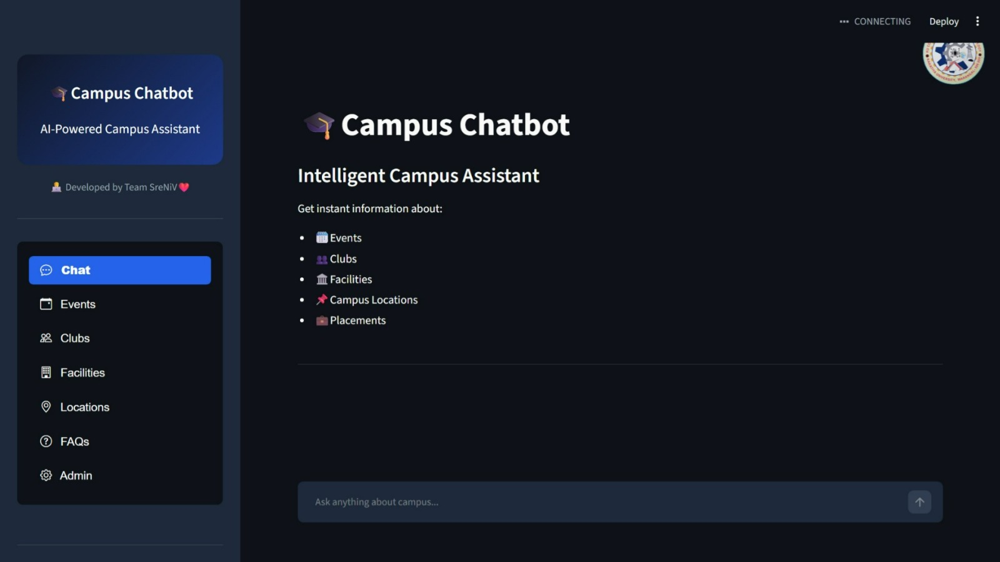
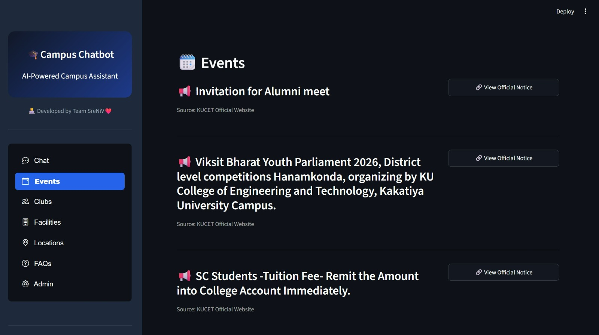
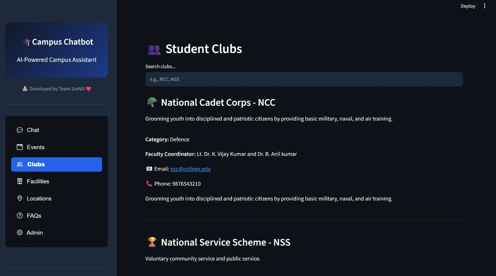
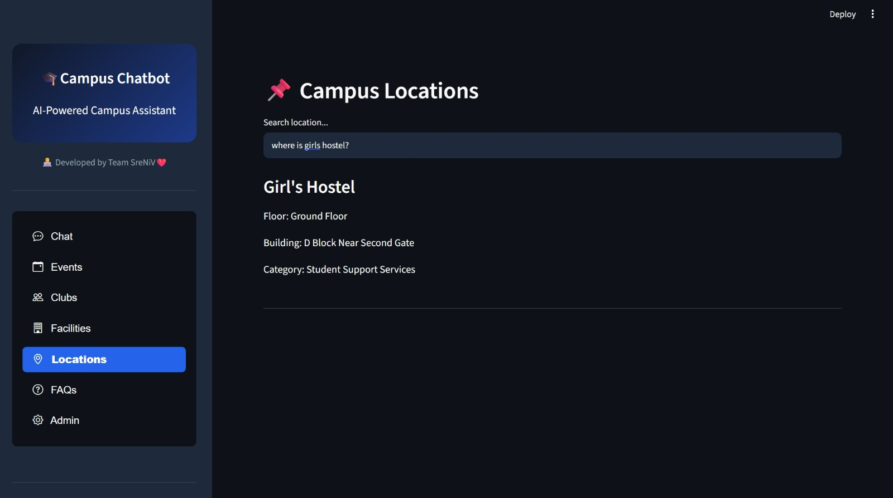
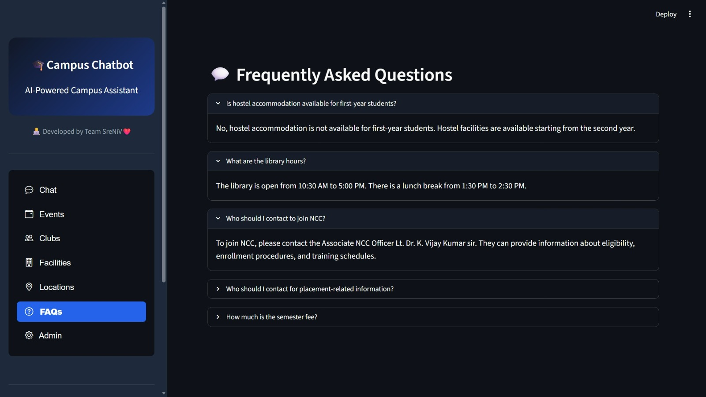
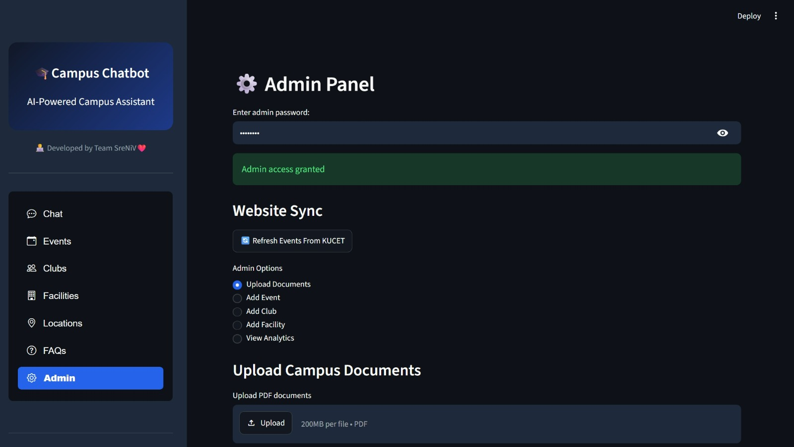

# 🎓 Campus Chatbot

An AI-powered campus information assistant developed for **Kakatiya University College of Engineering and Technology (KUCET)**. The system helps students quickly access information about campus facilities, events, clubs, locations, placements, and academic resources through an intelligent conversational interface.

The chatbot combines **Retrieval-Augmented Generation (RAG)**, **FAISS Vector Search**, **Google Gemini Embeddings**, and **Groq Llama 3.3** to provide accurate and context-aware responses.

---

## 🚀 Features

### 💬 AI Campus Assistant

* Natural language interaction
* Context-aware responses
* Chat history support
* Fast response generation using Groq LLM

### 📅 Events Module

* Displays latest KUCET events
* Direct links to official notices
* Automatic event synchronization from KUCET website
* Admin event management

### 🏫 Student Clubs

* Browse available student clubs
* Search clubs by name
* View coordinator information
* Contact details and descriptions

### 🏢 Campus Facilities

* Explore available campus facilities
* Category-wise facility organization
* Facility details and contact information

### 📍 Campus Location Finder

* Search for buildings, labs, lecture halls, hostels, and offices
* Quick campus navigation assistance
* Structured location information

### ❓ FAQ System

Provides answers for common student queries including:

* Hostel information
* Library timings
* Placement details
* Fee information
* NCC enrollment guidance

### ⚙️ Admin Dashboard

* Secure admin access
* Upload PDF documents
* Refresh KUCET event information
* Add/Delete Events
* Add/Delete Clubs
* Add/Delete Facilities
* View chatbot analytics

---

## 🧠 AI Architecture

The chatbot uses a Retrieval-Augmented Generation (RAG) workflow.

### Workflow

1. Admin uploads campus documents.
2. Documents are processed and split into chunks.
3. Gemini Embeddings generate vector representations.
4. FAISS stores document embeddings.
5. User query is matched against relevant document chunks.
6. Retrieved context is sent to Groq Llama 3.3.
7. AI generates a campus-specific response.

---

## 🛠️ Tech Stack

### Frontend

* Streamlit

### Backend

* Python

### AI & Machine Learning

* LangChain
* Groq API
* Google Generative AI Embeddings
* FAISS Vector Database

### Database

* SQLite3

### Web Scraping

* Requests
* BeautifulSoup4

### Document Processing

* PyPDF2

---

## 📂 Project Structure

```text
campus-ai-chatbot/
│
├── app.py
├── config.py
├── requirements.txt
├── .env
├── .gitignore
├── load_sample_data.py
│
├── assets/
│
├── prompts/
│
├── data/
│   ├── campus_chatbot.db
│   ├── college_handbook.pdf
│   ├── clubs.json
│   ├── events.json
│   ├── facilities.json
│   ├── kucet_docs.json
│   ├── locations.json
│   ├── sample_data.py
│   │
│   └── faiss_index/
│       ├── index.faiss
│       └── index.pkl
│
├── src/
│   ├── __init__.py
│   ├── database.py
│   ├── document_processor.py
│   ├── knowledge_base.py
│   ├── llm_handler.py
│   ├── location_service.py
│   ├── web_scraper.py
│   ├── context_builder.py
│   ├── update_kucet_kb.py
│   └── test_scraper.py
│
├── utils/
│   ├── formatters.py
│   └── validators.py
│
└── .streamlit/
    └── config.toml
```

---

## 📊 Database Modules

### Queries

Stores:

* User queries
* Bot responses
* Session information
* User feedback

### Events

Stores:

* Event details
* Official notice links
* Event metadata

### Clubs

Stores:

* Club information
* Faculty coordinators
* Contact information

### Facilities

Stores:

* Facility information
* Timings
* Amenities
* Contact details

### Locations

Stores:

* Campus locations
* Building information
* Floor details

---

## ⚙️ Installation

### Clone Repository

```bash
git clone https://github.com/your-username/campus-ai-chatbot.git
cd campus-ai-chatbot
```

### Create Virtual Environment

```bash
python -m venv venv
```

### Activate Environment

Windows:

```bash
venv\Scripts\activate
```

Linux/Mac:

```bash
source venv/bin/activate
```

### Install Dependencies

```bash
pip install -r requirements.txt
```

### Configure Environment Variables

Create a `.env` file:

```env
GROQ_API_KEY=your_groq_api_key
GOOGLE_API_KEY=your_google_api_key
CAMPUS_WEBSITE=https://kakatiya.ac.in/
```

### Run Application

```bash
streamlit run app.py
```

---

## 📸 Screenshots

### 💬 Chat Interface

AI-powered conversational campus assistant.



### 📅 Events Module

Displays latest KUCET announcements and official notices.



### 🏫 Student Clubs

Browse clubs, coordinators, and contact details.



### 📍 Campus Locations

Search hostels, labs, classrooms, and buildings.



### ❓ FAQ System

Quick answers to frequently asked student questions.



### ⚙️ Admin Dashboard

Manage documents, events, clubs, facilities, and analytics.



---

## 🎯 Sample Questions

```text
Where is the girl's hostel?

What are the library timings?

How can I join NCC?

Show upcoming campus events.

Where is the Data Science Lab?

Who is the placement officer?
```

---

## 🔮 Future Enhancements

* Voice-enabled assistant
* Multilingual support
* Interactive campus map
* Student authentication
* Mobile application
* Placement recommendation system
* Event registration portal
* Hostel management integration

---

## 👩‍💻 Team

Developed by:

* Vaishnavi
* Sreshta
* Nithya

---

## 🏛️ Institution

**Kakatiya University College of Engineering and Technology (KUCET)**
Warangal, Telangana, India

---

## 📜 License

This project is developed for academic and educational purposes.
